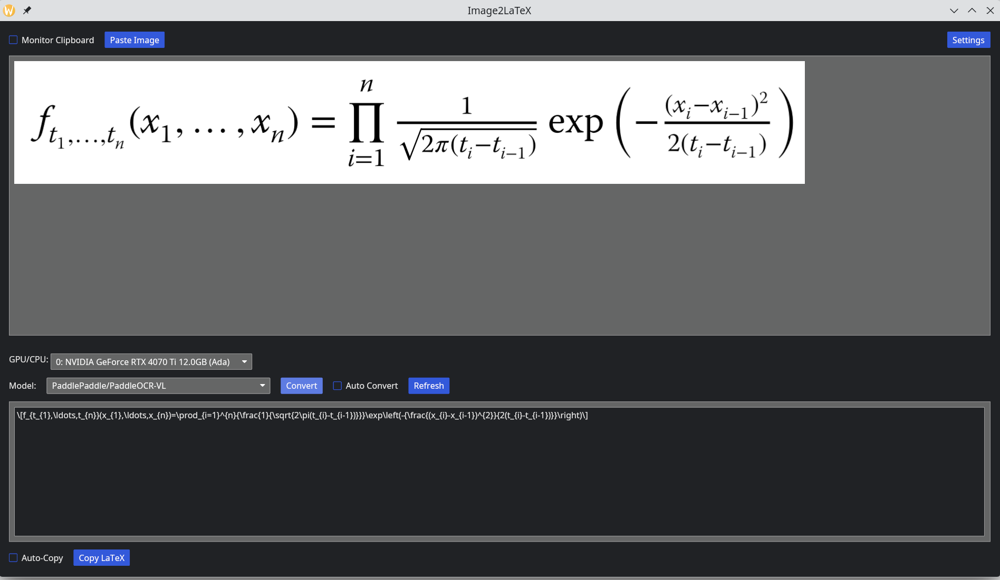

# Image2LaTeX

A cross-platform desktop application that converts images of mathematical equations  into LaTeX using LLMs. It supports direct local conversion using HuggingFace models, local and cloud conversions using Ollama models and conversion API key based conversion by commercial vision compatible models such as Gemini-Flash/GPT-4o.



## Features

- **Multiple model backends** — Direct local inference via HuggingFace and the Rust Candle crate (fastest), local or cloud based [Ollama](https://ollama.com/download) server, or web using standard OpenAI API
- **Clipboard monitoring** — Optional automatically detection of images copied to the clipboard
- **Auto convert** — Optionally processes images as soon as they are detected in the clipboard
- **Auto copy** — Optionally copies detected results back to the clipboard as text.

Local conversion uses GPU acceleration with CUDA for Linux or Windows and Metal for macOS. If you have more than one GPU, you can specify which one to use in the application
for the HuggingFace/Candle models (Ollama documentation says it uses all GPU's but you can also specify one via environment variables).
CPU is also supported but is much slower (its usually faster to use the cloud/web based models than CPU inference).

## Supported Models

### Local (HuggingFace / Candle)

| Model | Parameters | Notes |
|-------|-----------|-------|
| PaddleOCR-VL | — | Possibly the best in terms of accuracy and speed |
| Qwen3-VL-2B-Instruct | 2B | Lower GPU memory usage, while still producing good results |
| Qwen3-VL-4B-Instruct | 4B | More memory than the 2B version, with better accuracy |

**Note**: On first use the application downloads model weights from HuggingFace and caches them locally which takes some time as the files are typically several Gigabytes in size (similar to pulling Ollama models). Thereafter the cached files are used so further downloads are not required, but the first use in the application still requires loading the inference data to the GPU memory which takes a small amount of extra time. Once in GPU memory, OCR processing time should be fast, until a new model is selected resulting in the GPU memory being cleared and the new models inference data being loaded which again takes a small amount of time (unless it needs to be downloaded in which case it takes longer).

See the **Files** subsection below for details on where the cached model files are stored locally in case you want to delete them or change the default location (the latter applies especially to Apple Mac Mini users).

### Ollama

Requires Ollama installed and running (The local Ollama URL to use can be configured in the settings, the default used is `http://localhost:11434`).

Various recommended OCR and vision-language models available in the [Ollama registry](https://ollama.com/search) are listed in the dropdown of which GLM-OCR, DeepSeek-OCR and and Qwen3-VL variants are possibly the best to use in an OCR context. Until locally installed using 
`ollama pull <model-name>` for local models or `ollama run <model-name>` for cloud models, these models will not be usable and will display (N/A) in the dropdown. 


### Commercial Web models

Gemini 2.5 Flash Lite, Gemini 2.5 Flash, GPT-4o-mini and GPT-4o, (all low cost vision models which should still be adequate for OCR) via the chat completions API. Requires an API key which can be entered in the settings (the key is encrypted in the settings file) or alternately using environment variable such as `OPENAI_API_KEY` or `GEMINI_API_KEY` depending on the model used. Also note the two Gemini models also qualify for free tier usage limits: 

1. Gemini 2.5 Flash-Lite ~1,000 requests per day or 
2. Gemini 2.5 Flash ~250 requests per day

A Google account is required to use the Gemini models and an API key is still required for free tier usage which can be generated in [Google AI Studio](https://aistudio.google.com/app/api-keys).

Ollama paid cloud models which require API keys are also supported and the Qwen 3VL 235B model can be selected in the dropdown with the API key set in the settings (or use OLLAMA_API_KEY env. variable). The same model is available for cloud use without an API key if it is installed (```ollama run```) in the local Ollama server, but will execute with lower priority and have less usage limitations in the paid version.

## Building

Requires Rust toolchain and Cargo. For GPU support, also requires CUDA toolkit (Linux/Windows) or Xcode command line tools (macOS).

### Linux / macOS

```sh
# CPU-only build
cargo build --release

# With specific NVIDIA GPU architecture support (Linux)
CUDA_COMPUTE_CAP=75 cargo build --release --features cuda

# With Apple Metal support (macOS)
cargo build --release --features metal
```

### Windows (CUDA)

Building with CUDA on Windows requires additional setup because `nvcc` and the linker need header and library paths that are not set by default outside of a Visual Studio Developer Command Prompt.

#### Prerequisites

1. **Rust toolchain** with the `x86_64-pc-windows-msvc` target
2. **Visual Studio 2022** (Community or higher) with the **MSVC C++ build tools** and the **Windows Universal CRT SDK** (install via the Visual Studio Installer)
3. **NVIDIA CUDA Toolkit** (e.g. v13.1) — [download](https://developer.nvidia.com/cuda-downloads)
4. **NVIDIA cuDNN** — [download](https://developer.nvidia.com/cudnn-downloads) (the install includes several versions of the cuDNN library matching different CUDA versions, ensure you select the correct one for your CUDA installation)

If installing Rust as per the instructions from the Rust web site then steps 1 and 2 are (mostly) done by the Rust installation process as the `x86_64-pc-windows-msvc` target is the default on Windows and the Visual Studio Build Tools are required for Rust to compile. However, you may need to install the Windows Universal CRT SDK separately via the Visual Studio Installer (Individual Components) or alternately install the Desktop Development with C++ workload which includes various command line tools.

#### Environment setup

The CUDA build requires the `INCLUDE`, `LIB`, and `PATH` environment variables to contain the MSVC, Windows SDK, CUDA, and cuDNN paths. Either build from the **x64 Native Tools Command Prompt for VS 2022** chosen from the Windows Application menu when typing x64 N for example (which sets the MSVC and Windows SDK paths automatically), or set them manually.

Create a batch file (e.g. `sett.bat`) to configure all the required paths — adjust the version numbers to match your installation:

```bat
@echo off
rem ---- MSVC and Windows SDK ----
set INCLUDE=C:\Program Files\Microsoft Visual Studio\2022\Community\VC\Tools\MSVC\14.44.35207\include;C:\Program Files (x86)\Windows Kits\10\Include\10.0.26100.0\ucrt;C:\Program Files (x86)\Windows Kits\10\Include\10.0.26100.0\shared;C:\Program Files (x86)\Windows Kits\10\Include\10.0.26100.0\um
set LIB=C:\Program Files\Microsoft Visual Studio\2022\Community\VC\Tools\MSVC\14.44.35207\lib\x64;C:\Program Files (x86)\Windows Kits\10\Lib\10.0.26100.0\ucrt\x64;C:\Program Files (x86)\Windows Kits\10\Lib\10.0.26100.0\um\x64

rem ---- cuDNN headers and libraries ----
set INCLUDE=%INCLUDE%;C:\Program Files\NVIDIA\CUDNN\v9.19\include\13.1
set LIB=%LIB%;C:\Program Files\NVIDIA\CUDNN\v9.19\lib\13.1\x64

rem ---- CUDA and cuDNN runtime DLLs ----
set PATH=%PATH%;C:\Program Files\NVIDIA GPU Computing Toolkit\CUDA\v13.1\bin\x64;C:\Program Files\NVIDIA\CUDNN\v9.19\bin\13.1\x64
```

> **Note**: The MSVC and Windows SDK version numbers (e.g. `14.44.35207`, `10.0.26100.0`) will differ between installations. Check your installed versions under `C:\Program Files\Microsoft Visual Studio\2022\Community\VC\Tools\MSVC\` and `C:\Program Files (x86)\Windows Kits\10\Include\`. Similarly, update the CUDA and cuDNN paths to match your installed versions.

#### Build

```cmd
sett.bat
set CUDA_COMPUTE_CAP=75
cargo build --release --features cuda
```

#### Running

Fortunately it appears the only DLL dependencies are cublas64_xx.dll and cudnn64_xx.dll (where xx is the version number) so for the moment placing them in the same directory as the built executable should work without needing to set the `PATH` (perhaps later an installer can be created to handle this more elegantly). 

```cmd
target\release\image2latex.exe
```
If only I could have a holiday as long as all the time I've spent making things work on Windows !!!

### CUDA Compute Capability

Set `CUDA_COMPUTE_CAP` to match the lowest GPU architecture to support e.g. `61` for Pascal (RTX 10XX), `75` for Turing (RTX 20XX), `86` or `89` for Ampere (RTX 30XX, A100), `90` for Ada Lovelace (RTX 40XX) and `120` for Blackwell (RTX 50XX) (Blackwell requires \(\ge\) CUDA 12.8).


| Architecture | Example Consumer GPU | **Official CUDA Compute Capability** | `CUDA_COMPUTE_CAP`/10 |
| :--- | :--- | :--- | :--- |
| **Pascal (2016)** | RTX 1080 Ti, RTX 1070 | 6.1 | `6.1` |
| **Turing (2018)** | RTX 2080 Ti, RTX 2070 | 7.5 | `7.5` |
| **Ampere (2020)** | RTX 3080, RTX 3090 | 8.6, 8.9 | `8.6`, `8.9` |
| **Ada Lovelace (2022)** | RTX 4080, RTX 4090 | **9.0** | `9.0` |
| **Blackwell (2025)** | **RTX 50-series (e.g., RTX 5090)** | **12.0** | **`12.0`** |


## Files

### HuggingFace/Candle model files

| Operating System | Default Model Cache Directory |
| :--- | :--- |
| **Linux** | `~/.cache/huggingface/hub/` |
| **macOS** | `~/.cache/huggingface/hub/` |
| **Windows** | `C:\Users\<username>\.cache\huggingface\hub\` |

> Note: On old HuggingFace hub versions a deprecated `~/.cache/huggingface/transformers/` path may be used.

#### Changing the Cache Location

If you need to free up space on your main drive or organize your projects, you can redirect the cache. You can set different caches for different types of files.

| Purpose | Environment Variable | Effect & Scope |
| :--- | :--- | :--- |
| **Central Control** | `HF_HOME` | Sets a new root for **all** HuggingFace caches. Model cache becomes `<HF_HOME>/hub/`, datasets cache `<HF_HOME>/datasets/`. |
| **Model Cache Only** | `HF_HUB_CACHE` | Changes **only** the `hub` directory for models, tokenizers, and other Hub downloads. |
| **Legacy (Transformers)** | `TRANSFORMERS_CACHE` | Changes cache for the `transformers` library only. **Note**: Deprecated in favour of `HF_HOME` or `HF_HUB_CACHE`. |
| **Datasets Cache Only** | `HF_DATASETS_CACHE` | Changes **only** the cache for the `datasets` library (Arrow files). |

### Application Settings

| Platform | Path |
|----------|------|
| Linux | `~/.config/image2latex/` |
| macOS | `~/Library/Application Support/image2latex/` |
| Windows | `%LOCALAPPDATA%\image2latex\` |

`settings.json` stores preferences (last model, window size, Ollama URL, encrypted API keys and application theme).

## Project Structure

| File | Purpose |
|------|---------|
| `main.rs` | Iced application, UI layout, event handling |
| `llm.rs` | LLM type abstractions and dispatch |
| `llm_util.rs` | Model discovery, API calls, math extraction |
| `qwen3_vl.rs` | Qwen3-VL local inference (image preprocessing, generation) |
| `paddleocr_vl.rs` | PaddleOCR-VL local inference |
| `settings.rs` | Config persistence and encryption key management |
| `crypt.rs` | AES-GCM encryption utilities |
| `status.rs` | Cross-thread status messages for the UI progress bar |

